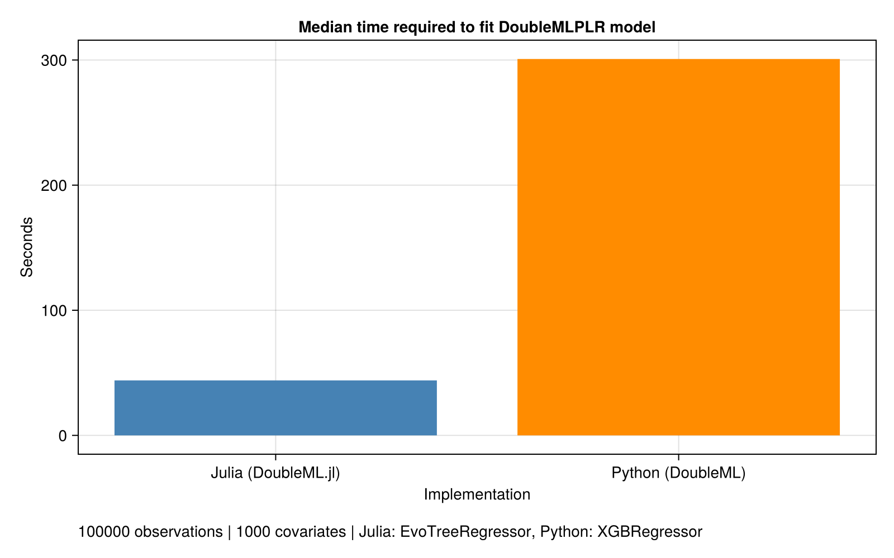

# DoubleML Performance Benchmark: Julia vs Python

**Generated:** 2026-08-08T11:35:17.322

## Hardware

| Component | Specification |
|-----------|---------------|
| CPU | Intel(R) Core(TM) i7-14700K (28 threads) |
| RAM | 63 GB |
| OS | Linux |

## Test Configuration

| Parameter | Value |
|-----------|-------|
| Observations | 100000 |
| Covariates | 1000 |
| Treatment Effect (true) | 0.5 |
| Cross-fitting Folds | 5 |

## Learners Used

| Language | Learner |
|----------|---------|
| Julia | EvoTreeRegressor (100 trees, max_depth=6, eta=0.1) |
| Python | XGBRegressor (100 trees, max_depth=6, learning_rate=0.1) |

## Timing Results

### Julia (DoubleML.jl)

| Metric | Time (seconds) |
|--------|----------------|
| Median | 43.95s |
### Python (DoubleML)

| Metric | Time (seconds) |
|--------|----------------|
| Median | 300.8s |

### Performance Comparison

**Winner: Julia**

- **Speedup Factor:** 6.84x (Julia is faster)
- **Time Difference:** 256.85s

## Coefficient Estimates

| Metric | Julia | Python | Difference |
|--------|-------|--------|------------|
| Coefficient | 0.487116 | 0.485441 | 0.001675 (0.34%) |
| Std Error | 0.003136 | 0.003144 | 8.0e-6 (0.26%) |

**True Treatment Effect:** 0.5

### Accuracy Assessment

- **Coefficient Accuracy:** Estimates differ by 0.34% from each other
- **Standard Error Agreement:** SEs differ by 0.26%

✓ Coefficient estimates are in good agreement (< 5% difference)
✓ Standard errors are in good agreement (< 10% difference)

## Summary

This benchmark compares DoubleML.jl (Julia) against the Python DoubleML package on identical data:
- 100000 observations with 1000 covariates
- Using gradient boosted trees (EvoTrees in Julia, XGBoost in Python)
- Both implementations use the same partialling_out score function

### Key Findings

1. **Performance:** Julia is 6.84x faster
2. **Accuracy:** Both implementations produce similar coefficient estimates (0.34% difference)
3. **Inference:** Standard errors are consistent between implementations (0.26% difference)

## Raw Data Files

- Julia results: `benchmark_results_julia.json`
- Python results: `benchmark_results_python.json`
- Shared data: `benchmark_data.csv`

---

*Note: Benchmarks run on 100000 observations with 1000 dimensions. Times measured using BenchmarkTools (Julia) with automatic sample size determination and time.perf_counter() (Python) with 3 repetitions.*
